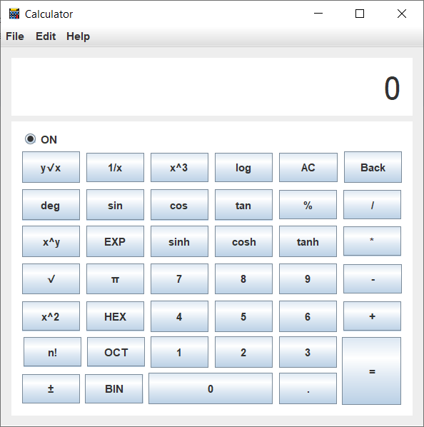
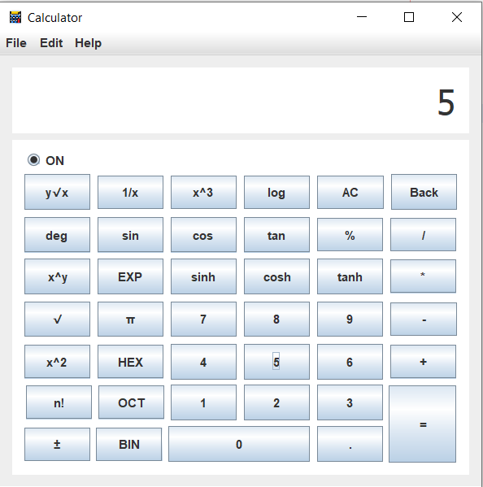
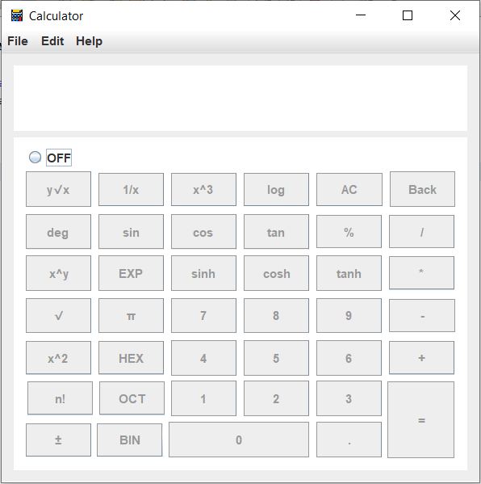

# Scientific-Calculator

This program is designed to act like a “Scientific calculator” with the usual standard functions (add, subtract, multiply, divide, modulus).
Also, the calculator will have the capability of performing functions in binary (base 2), octal (base 8) and hexadecimal (base 16),
in addition to the usual decimal (base 10). On the other head the calculator will have the capability of performing trigonometric 
functions in (sin), (sinh), (cos), (cosh), (tan), (tanh). 

<h2>Using Software Tools:</h2>
NetBeans IDE 8.2

 <h2 align="center">
   
</h2>
 <h2 align="center">
   
</h2>
 <h2 align="center">
   
</h2>
